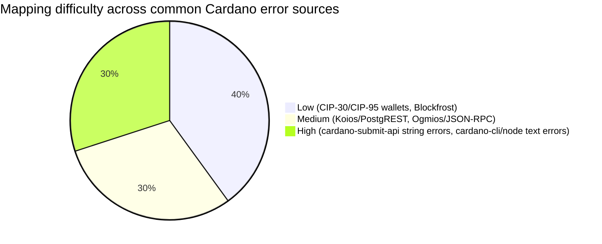
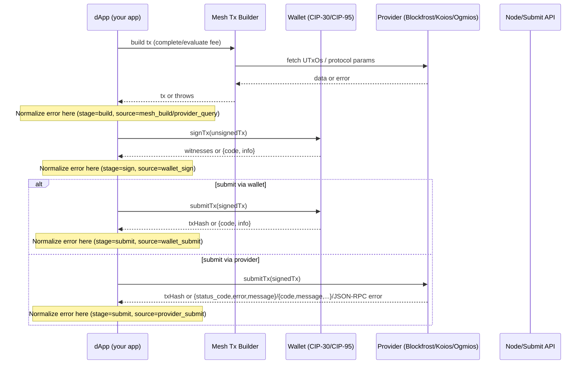

# Designing a Portable Cardano Error-Normalization Library

## Executive summary

Error payloads across the Cardano dApp stack are inconsistent because they originate from fundamentally different layers with different protocols and standards: browser wallets (CIP-30/CIP-95), REST API providers (Blockfrost, Koios), JSON-RPC gateways (Ogmios), and node/CLI tooling (cardano-node, cardano-submit-api). The good news is that each layer is consistent **within itself** (e.g., Blockfrost’s `status_code/error/message` object, PostgREST’s `code/message/details/hint`, JSON-RPC’s `error.code/error.message/error.data`, CIP-30’s `code/info`). The bad news is you’re forced to correlate them in your app, and some layers return **only strings** (cardano-submit-api) or extremely verbose nested Haskell failure text (cardano-cli / node submit failures). citeturn21view3turn20view1turn11view0turn29view1turn26view0turn28view2

A small library can normalize these sources into a single **CardanoAppError** shape while preserving the original payload verbatim for diagnostics. The core strategy is:

- Standardize a **stage** (`build | sign | submit`) and a **source** (`wallet_sign | wallet_submit | provider_submit | provider_query | node_submit | mesh_build`, etc.).
- Implement adapters that convert raw errors into a **stable internal taxonomy** (20–40 codes), using:
  - deterministic mapping (CIP-30/CIP-95 codes, HTTP status codes),
  - parsing structured payloads (Blockfrost, PostgREST/Koios, JSON-RPC/Ogmios),
  - and regex heuristics for “stringly typed” node/CLI failures (ApplyTxError/ValidationError fragments).
- Add correlation fields (txHash when available, wallet name/version when available, network, provider, timestamps) and produce logs in a consistent machine-parsable format. citeturn21view3turn20view1turn11view0turn29view1turn30view0

For your stack (Mesh + Blockfrost + Eternl), this design directly covers:
- wallet errors via CIP-30 (and CIP-95 if enabled),
- Blockfrost errors via OpenAPI-defined response shapes,
- Mesh build/evaluate/submit errors by wrapping thrown exceptions and then delegating to the underlying provider adapter when possible. citeturn21view3turn20view1turn12view0turn30view0

## Ecosystem error surfaces and prioritized sources

### Primary sources to anchor the library

Wallet/bridge layer:
- CIP-30 defines the web-wallet bridge API and explicitly defines error types such as `APIError`, `TxSignError`, `TxSendError`, and `DataSignError`, each with a stable `code` and `info` field. citeturn21view3turn21view2turn21view4  
- CIP-95 extends CIP-30 in the Conway era, explicitly extending `TxSignError` with an additional `DeprecatedCertificate` code and clarifying semantics. citeturn21view6  

Provider layer:
- Blockfrost’s OpenAPI spec defines the canonical error payload shape as an object with `status_code`, `error`, and `message`, and documents related HTTP error semantics (e.g., 425 mempool full). citeturn20view1turn20view0  
- Koios’ OpenAPI/description states it uses PostgREST underneath. citeturn10view0  
- PostgREST documents its error response structure (`code`, `message`, `details`, `hint`) and how errors map from PostgreSQL and PostgREST itself. citeturn11view0turn11view1  

Node/gateway layer:
- Ogmios documents transaction submission as a JSON-RPC flow, returning an error on failure and no result on success. citeturn13view0  
- Ogmios’ API v6 rewrite decision record documents: (a) JSON-RPC 2.0 adoption, (b) distinct error-code ranges by mini-protocol (e.g., 3000–3999 for transaction submission/evaluation), and (c) a heuristic to return only the most relevant error rather than a cascading list. citeturn18view0  
- JSON-RPC 2.0 specification defines the error object (`code`, `message`, optional `data`) and shows example error payloads. citeturn29view1  
- cardano-submit-api Swagger spec defines its 400 response schema as an **error message string**, not a structured object. citeturn26view0  
- Real-world cardano-cli/node submit failures appear as nested ledger failures (e.g., `ShelleyTxValidationError … ApplyTxError …` with sub-failures like `BabbageOutputTooSmallUTxO`, `ValueNotConservedUTxO`, `BadInputsUTxO`). citeturn28view2  
- Node-side parse/decoder failures can present as `DecoderFailure … DeserialiseFailure …` strings. citeturn28view1  

### Provider and wallet comparison table

The goal of this table is not to judge quality, but to highlight what your normalizer must handle “as-is”: multiple transports, multiple payload shapes, and multiple levels of structure.

| Surface | Transport | Typical error shape | Example payload | Mapping difficulty |
|---|---|---|---|---|
| Wallet via CIP-30 / CIP-95 | Injected JS API | `{ code, info }` where `code` is stable enum-like | `TxSignErrorCode = { ProofGeneration: 1, UserDeclined: 2 }` and `type TxSignError = { code, info }` citeturn21view2turn21view6 | Low |
| Blockfrost | REST (HTTP) | `{ status_code, error, message }` | `{"status_code":425,"error":"Mempool Full","message":"Mempool is full, please try resubmitting again later."}` citeturn20view1 | Low |
| Koios | REST (HTTP), PostgREST | `{ code, message, details, hint }` | `{"code":"42P01","message":"relation \"api.nonexistent_table\" does not exist","details":null,"hint":null}` citeturn11view1turn10view0 | Medium |
| Ogmios | JSON-RPC 2.0 (WS/HTTP) | `{ jsonrpc, error: { code, message, data? }, id }` plus Ogmios-specific code ranges | JSON-RPC example: `{"jsonrpc":"2.0","error":{"code":-32601,"message":"Method not found"},"id":"1"}` citeturn29view1turn18view0 | Medium |
| cardano-submit-api | REST (HTTP) | Plain string body on error | Swagger: `400 … schema: type: string description: An error message.` citeturn26view0 | High |
| cardano-cli / node submit failures | CLI text / logs | Nested Haskell-rendered validation failures (string) | `ShelleyTxValidationError … (ApplyTxError [UtxowFailure … BabbageOutputTooSmallUTxO … ValueNotConservedUTxO … BadInputsUTxO …])` citeturn28view2 | High |
| Mesh SDK layer | JS exceptions + underlying provider errors | Often “thrown Error” (shape varies), sometimes wraps provider errors | Mesh docs acknowledge “Transaction submit error” and differentiate evaluation/submission methods. citeturn12view0 | Medium–High |

### Mapping difficulty chart

This is a pragmatic assessment for building a normalizer (not a claim about these projects’ quality).



## Canonical CardanoAppError shape and starter taxonomy

### Canonical TypeScript type

This is the “single error object in your app” made explicit, with room for correlation and for preserving verbatim raw payloads.

```ts
export type ErrorSource =
  | "mesh_build"
  | "wallet_sign"
  | "wallet_submit"
  | "provider_query"
  | "provider_submit"
  | "node_submit";

export type ErrorStage = "build" | "sign" | "submit";

export type ErrorSeverity = "debug" | "info" | "warn" | "error";

export interface CardanoAppError {
  name: "CardanoAppError";

  // High-level classification
  source: ErrorSource;
  stage: ErrorStage;
  code: CardanoErrorCode;          // stable internal taxonomy
  severity: ErrorSeverity;

  // Friendly messages
  message: string;                // concise, user-facing safe summary
  detail?: string;                // dev-facing (can include hints, redacted)

  // Correlation & environment
  timestamp: string;              // ISO8601
  network?: "mainnet" | "preprod" | "preview" | "sanchonet" | "unknown";
  provider?: "blockfrost" | "koios" | "ogmios" | "cardano-node" | string;
  wallet?: {
    name?: string;                // e.g., "eternl"
    apiVersion?: string;          // CIP-30 metadata when available
    version?: string;             // if the wallet exposes it (often not)
  };

  // Transaction context (best-effort)
  txHash?: string;                // once known / computed
  txCborHexHash?: string;         // optional: hash of CBOR or tx body to correlate pre-submit

  // Original error payload, stored verbatim (or minimally wrapped)
  raw: unknown;

  // Optional “fingerprint” for grouping in logs/analytics
  fingerprint?: string;

  // Optional machine-readable structured hints for callers
  meta?: Record<string, unknown>;
}
```

Why this works well with the ecosystem:

- CIP-30/CIP-95 wallet errors are fundamentally `{code, info}` typed errors. Those map cleanly into `code`, `message/detail`, and `raw`. citeturn21view3turn21view6  
- Blockfrost’s error object provides stable fields that should be preserved verbatim in `raw`, while `code` is mapped deterministically using `status_code` plus message patterns. citeturn20view1turn20view0  
- JSON-RPC 2.0 already defines an error envelope; Ogmios further partitions error code ranges by mini-protocol to help classification. citeturn29view1turn18view0turn13view0  
- Koios inherits PostgREST’s structured error format, which is already stable across many PostgREST deployments. citeturn10view0turn11view0  
- cardano-submit-api explicitly does **not** standardize a JSON object for 400 errors, so the `raw` payload may be a string; the normalizer must be prepared for that. citeturn26view0  

### Recommended starter taxonomy (roughly 30 codes)

These codes aim to be stable and “actionable” rather than mirroring every ledger rule. The internal codes do not have to be perfect; they have to be consistent.

| Code | Definition | Typical surface(s) |
|---|---|---|
| `UNKNOWN` | No match; preserve raw | All |
| `UNEXPECTED_SHAPE` | Error payload doesn’t match expected structure | All |
| `NETWORK_UNREACHABLE` | Connection failure, DNS, CORS, offline | Providers, gateways |
| `TIMEOUT` | Request timed out | Providers, gateways |
| `RATE_LIMITED` | Rate limit hit | Blockfrost, Koios |
| `UNAUTHORIZED` | Missing/invalid auth token | Blockfrost, Koios tiers |
| `FORBIDDEN` | Auth present but forbidden | Blockfrost, Koios |
| `NOT_FOUND` | Endpoint/resource missing | Blockfrost, Koios |
| `BAD_REQUEST` | Request invalid at protocol level | Providers, JSON-RPC |
| `PROVIDER_INTERNAL` | 5xx / internal provider error | Providers |
| `MEMPOOL_FULL` | Node/provider isn’t accepting new txs temporarily | Blockfrost, node |
| `WALLET_INVALID_REQUEST` | CIP-30 `APIError.InvalidRequest (-1)` | Wallet |
| `WALLET_INTERNAL` | CIP-30 `APIError.InternalError (-2)` | Wallet |
| `WALLET_REFUSED` | CIP-30 `APIError.Refused (-3)` | Wallet |
| `WALLET_ACCOUNT_CHANGED` | CIP-30 `APIError.AccountChange (-4)` | Wallet |
| `WALLET_SIGN_USER_DECLINED` | CIP-30/95 `TxSignError.UserDeclined` | Wallet |
| `WALLET_SIGN_PROOF_GENERATION` | CIP-30/95 `TxSignError.ProofGeneration` | Wallet |
| `WALLET_SIGN_DEPRECATED_CERTIFICATE` | CIP-95 `TxSignError.DeprecatedCertificate` | Wallet |
| `WALLET_SUBMIT_REFUSED` | CIP-30 `TxSendError.Refused` | Wallet |
| `WALLET_SUBMIT_FAILURE` | CIP-30 `TxSendError.Failure` | Wallet |
| `TX_DESERIALISE_FAILURE` | Tx bytes could not be decoded / parsed | Node, gateways |
| `TX_INPUTS_MISSING_OR_SPENT` | Inputs invalid / already spent (`BadInputsUTxO`) | Node/provider submit |
| `TX_OUTPUT_TOO_SMALL` | Output below min-UTxO (`OutputTooSmallUTxO`) | Node/provider submit |
| `TX_VALUE_NOT_CONSERVED` | Inputs/outputs/fees don’t balance (`ValueNotConservedUTxO`) | Node/provider submit |
| `TX_INVALID_SIGNATURES` | Missing/wrong witnesses, signers | Wallet, node |
| `TX_SCRIPT_EVALUATION_FAILED` | Plutus evaluation/redeemer budget failure | Ogmios, providers |
| `TX_VALIDITY_INTERVAL_INVALID` | TTL / validity interval issues | Node/provider submit |
| `TX_COLLATERAL_INSUFFICIENT` | Collateral missing/insufficient | Wallet, node |
| `TX_POLICY_OR_SCRIPT_REJECTED` | Policy/script rule failure (generic) | Node/provider submit |

Key grounding points for the taxonomy:

- CIP-30’s error codes (-1..-4 and separate `TxSignError`/`TxSendError`) are explicitly standardized; you should map them deterministically rather than using text matching. citeturn21view3turn21view2turn21view4  
- CIP-95 explicitly extends `TxSignError` with `DeprecatedCertificate`, and you should preserve that as a stable internal code because it is a deterministic wallet-reported condition. citeturn21view6  
- Blockfrost’s error responses and semantics (e.g., 425 mempool full) are explicitly defined in their OpenAPI. citeturn20view1turn20view0  
- Node/CLI failures often expose canonical sub-error “names” (e.g., `BadInputsUTxO`, `BabbageOutputTooSmallUTxO`, `ValueNotConservedUTxO`) in a string; your library can map those substrings to internal codes. citeturn28view2turn28view1  

## Adapter design and mapping heuristics

### Adapter API signatures

The library should be small and tree-shakeable: export a core normalizer plus optional adapters.

```ts
export interface NormalizeContext {
  source: ErrorSource;
  stage: ErrorStage;
  network?: CardanoAppError["network"];
  provider?: string;
  walletHint?: string; // e.g. "eternl"
  txHash?: string;
  timestamp?: string;  // override for testing
}

export type AdapterFn = (err: unknown, ctx: NormalizeContext) => CardanoAppError | null;

export interface Normalizer {
  normalize(err: unknown, ctx: NormalizeContext): CardanoAppError;
}

export function createNormalizer(config: NormalizerConfig): Normalizer;

// Adapters (individually importable)
export function fromWalletError(err: unknown, ctx: NormalizeContext): CardanoAppError | null;
export function fromBlockfrostError(err: unknown, ctx: NormalizeContext): CardanoAppError | null;
export function fromKoiosError(err: unknown, ctx: NormalizeContext): CardanoAppError | null;
export function fromOgmiosError(err: unknown, ctx: NormalizeContext): CardanoAppError | null;
export function fromCardanoNodeError(err: unknown, ctx: NormalizeContext): CardanoAppError | null;
export function fromMeshError(err: unknown, ctx: NormalizeContext): CardanoAppError | null;
```

### Exact payload examples and mapping rules by surface

Wallet layer (CIP-30 / CIP-95)
- CIP-30 defines `APIError` as `{ code: APIErrorCode, info: string }` with `InvalidRequest (-1)`, `InternalError (-2)`, `Refused (-3)`, `AccountChange (-4)`. citeturn21view3  
- CIP-30 defines `TxSignError` as `{ code, info }` with `ProofGeneration (1)` and `UserDeclined (2)`. citeturn21view2turn21view3  
- CIP-30 defines `TxSendError` as `{ code, info }` with `Refused (1)` and `Failure (2)`. citeturn21view3turn21view4  
- CIP-95 extends `TxSignError` with `DeprecatedCertificate (3)`. citeturn21view6  

Mapping is deterministic:

- If `{code: -1}` ⇒ `WALLET_INVALID_REQUEST`
- If `{code: -2}` ⇒ `WALLET_INTERNAL`
- If `{code: -3}` ⇒ `WALLET_REFUSED`
- If `{code: -4}` ⇒ `WALLET_ACCOUNT_CHANGED`
- If `{code: 2}` and error is `TxSignError` ⇒ `WALLET_SIGN_USER_DECLINED`
- If `{code: 1}` and error is `TxSignError` ⇒ `WALLET_SIGN_PROOF_GENERATION`
- If `{code: 3}` in CIP-95 `TxSignError` ⇒ `WALLET_SIGN_DEPRECATED_CERTIFICATE` citeturn21view3turn21view6  

Blockfrost layer
- Error responses are explicitly defined as an object with required fields `status_code`, `error`, and `message`. citeturn20view1  
- Specific statuses include:
  - 403 with message example “Invalid project token.”
  - 425 “Mempool Full” with “Mempool is full, please try resubmitting again later.”
  - 429 “Project Over Limit”
  - 418 auto-ban after flooding
  - 500 internal server error citeturn20view1turn20view0  

Mapping rules:

- `status_code === 425` ⇒ `MEMPOOL_FULL`
- `status_code === 429` ⇒ `RATE_LIMITED`
- `status_code === 403` ⇒ `UNAUTHORIZED` (or `FORBIDDEN` depending on your semantics)
- `status_code >= 500` ⇒ `PROVIDER_INTERNAL`
- Otherwise map by status buckets (`BAD_REQUEST`, `NOT_FOUND`, etc.) and optionally refine with regex on `message`. citeturn20view1  

Koios (PostgREST) layer
- Koios uses PostgREST underneath; thus errors are PostgREST-shaped. citeturn10view0  
- PostgREST forwards PostgreSQL errors and emits JSON with `code`, `details`, `hint`, `message`. Example: `code: "23502"` and a not-null constraint failure; PostgREST-specific errors have `code` prefix `PGRST…`. citeturn11view0turn11view1  

Mapping rules:

- If `code` starts with `PGRST`:
  - Map based on PostgREST docs: e.g. request body invalid (`PGRST102`) ⇒ `BAD_REQUEST`. citeturn11view0  
- If `code` is a PostgreSQL SQLSTATE (e.g., `42P01`, `23505`):
  - Map to `NOT_FOUND` / `BAD_REQUEST` / `CONFLICT` style categories; preserve original `code` as `meta.pgCode`. citeturn11view1turn11view0  

Ogmios (JSON-RPC) layer
- JSON-RPC defines the response error object and provides explicit examples. citeturn29view1  
- Ogmios adopts JSON-RPC 2.0 and uses unique error code ranges per mini-protocol (3000–3999 for tx submission/evaluation). citeturn18view0  
- Ogmios transaction submission returns an error on failure and effectively no result payload on success. citeturn13view0  

Mapping rules:

- If error conforms to JSON-RPC:
  - `error.code === -32601` ⇒ `BAD_REQUEST` or `NOT_FOUND` (method not found)
  - `error.code === -32700` ⇒ `BAD_REQUEST` (`TX_DESERIALISE_FAILURE` if submitting tx bytes and message indicates parse)
  - `error.code` in `3000..3999` ⇒ start with `TX_*` family; refine by `error.message` patterns and/or `error.data`. citeturn29view1turn18view0  

cardano-submit-api and cardano-node / CLI layer
- cardano-submit-api documents a 400 response as just a string “An error message.” citeturn26view0  
- CLI/node failures often surface as nested validation strings that contain stable “sub-error names” (e.g., `BadInputsUTxO`, `BabbageOutputTooSmallUTxO`, `ValueNotConservedUTxO`). citeturn28view2  
- Node decoder failures can surface as strings containing `DecoderFailure` and `DeserialiseFailure`. citeturn28view1  

Mapping heuristics (regex-style rules you can implement):

- `/DeserialiseFailure|DecoderFailure|expected word/i` ⇒ `TX_DESERIALISE_FAILURE` citeturn28view1  
- `/BadInputsUTxO/i` ⇒ `TX_INPUTS_MISSING_OR_SPENT` citeturn28view2  
- `/OutputTooSmallUTxO|BabbageOutputTooSmallUTxO/i` ⇒ `TX_OUTPUT_TOO_SMALL` citeturn28view2  
- `/ValueNotConservedUTxO/i` ⇒ `TX_VALUE_NOT_CONSERVED` citeturn28view2  
- Fallback: classify as `TX_POLICY_OR_SCRIPT_REJECTED` for other `ShelleyTxValidationError|ApplyTxError` strings, but keep `raw` unchanged. citeturn28view2  

### Sample code: core normalizer

```ts
import type { CardanoAppError, NormalizeContext, AdapterFn } from "./types";

function isoNow() {
  return new Date().toISOString();
}

function asErrorLike(err: unknown): { message?: string; name?: string } {
  if (err && typeof err === "object") {
    const anyErr = err as any;
    return { message: anyErr.message, name: anyErr.name };
  }
  return {};
}

export interface NormalizerConfig {
  appId?: string;
  adapters: AdapterFn[]; // ordered
  defaultNetwork?: CardanoAppError["network"];
  fingerprint?: (e: CardanoAppError) => string;
}

export function createNormalizer(config: NormalizerConfig) {
  return {
    normalize(err: unknown, ctx: NormalizeContext): CardanoAppError {
      const timestamp = ctx.timestamp ?? isoNow();

      for (const adapter of config.adapters) {
        const out = adapter(err, ctx);
        if (out) {
          const finalErr = {
            ...out,
            timestamp: out.timestamp ?? timestamp,
            network: out.network ?? ctx.network ?? config.defaultNetwork ?? "unknown",
          };
          if (config.fingerprint) {
            finalErr.fingerprint = config.fingerprint(finalErr);
          }
          return finalErr;
        }
      }

      const { message } = asErrorLike(err);

      return {
        name: "CardanoAppError",
        source: ctx.source,
        stage: ctx.stage,
        code: "UNKNOWN",
        severity: "error",
        message: message ?? "Unknown error",
        timestamp,
        network: ctx.network ?? config.defaultNetwork ?? "unknown",
        provider: ctx.provider,
        raw: err,
      };
    },
  };
}
```

## Sample code: Blockfrost adapter

This adapter strictly follows the OpenAPI-defined `status_code/error/message` shape and maps key status codes deterministically. citeturn20view1turn20view0  

```ts
import type { AdapterFn, CardanoAppError, NormalizeContext } from "./types";

type BlockfrostErrorBody = {
  status_code: number;
  error: string;
  message: string;
};

function isBlockfrostErrorBody(x: any): x is BlockfrostErrorBody {
  return (
    x &&
    typeof x === "object" &&
    typeof x.status_code === "number" &&
    typeof x.error === "string" &&
    typeof x.message === "string"
  );
}

function codeFromStatus(status: number): CardanoAppError["code"] {
  if (status === 425) return "MEMPOOL_FULL";
  if (status === 429) return "RATE_LIMITED";
  if (status === 403) return "UNAUTHORIZED";
  if (status === 404) return "NOT_FOUND";
  if (status >= 500) return "PROVIDER_INTERNAL";
  if (status >= 400) return "BAD_REQUEST";
  return "UNKNOWN";
}

export const fromBlockfrostError: AdapterFn = (err, ctx) => {
  // common patterns:
  // - your HTTP client throws { response: { status, data } }
  // - or you already have body
  const anyErr = err as any;

  const body =
    isBlockfrostErrorBody(anyErr) ? anyErr :
    isBlockfrostErrorBody(anyErr?.response?.data) ? anyErr.response.data :
    null;

  if (!body) return null;

  const status = body.status_code;
  const mapped = codeFromStatus(status);

  const severity: CardanoAppError["severity"] =
    status === 425 || status === 429 ? "warn" : status >= 500 ? "error" : "error";

  return {
    name: "CardanoAppError",
    source: ctx.source,
    stage: ctx.stage,
    code: mapped,
    severity,
    message: body.message,
    detail: `${body.error} (HTTP ${status})`,
    timestamp: ctx.timestamp,
    provider: ctx.provider ?? "blockfrost",
    network: ctx.network,
    txHash: ctx.txHash,
    raw: body,
    meta: { httpStatus: status, providerError: body.error },
  };
};
```

## Sample code: Eternl adapter (CIP-30 + practical wallet discovery)

Eternl adheres to CIP-30 for injected connections, but it is also historically exposed under both `window.cardano.eternl` and `window.cardano.ccvault`, which affects how developers discover the wallet and how they label it for correlation. citeturn21view3turn22search0turn30view0  

```ts
import type { AdapterFn, CardanoAppError } from "./types";

// CIP-30 error shapes
type Cip30Error = { code: number; info: string };

function isCip30Error(x: any): x is Cip30Error {
  return x && typeof x === "object" && typeof x.code === "number" && typeof x.info === "string";
}

function mapCip30CodeToInternal(code: number, ctxStage: "build" | "sign" | "submit"): CardanoAppError["code"] {
  // APIErrorCode (negative)
  if (code === -1) return "WALLET_INVALID_REQUEST";
  if (code === -2) return "WALLET_INTERNAL";
  if (code === -3) return "WALLET_REFUSED";
  if (code === -4) return "WALLET_ACCOUNT_CHANGED";

  // TxSignErrorCode / TxSendErrorCode (positive)
  if (ctxStage === "sign") {
    if (code === 1) return "WALLET_SIGN_PROOF_GENERATION";
    if (code === 2) return "WALLET_SIGN_USER_DECLINED";
    if (code === 3) return "WALLET_SIGN_DEPRECATED_CERTIFICATE"; // CIP-95 extension (best-effort)
  }

  if (ctxStage === "submit") {
    if (code === 1) return "WALLET_SUBMIT_REFUSED";
    if (code === 2) return "WALLET_SUBMIT_FAILURE";
  }

  return "UNKNOWN";
}

export const fromWalletError: AdapterFn = (err, ctx) => {
  const anyErr = err as any;

  // Some wallets throw the CIP-30 object directly.
  if (isCip30Error(anyErr)) {
    const internal = mapCip30CodeToInternal(anyErr.code, ctx.stage);

    return {
      name: "CardanoAppError",
      source: ctx.source,
      stage: ctx.stage,
      code: internal,
      severity: internal.includes("DECLINED") || internal.includes("REFUSED") ? "info" : "error",
      message: anyErr.info || "Wallet error",
      timestamp: ctx.timestamp,
      provider: ctx.provider,
      network: ctx.network,
      wallet: { name: ctx.walletHint ?? "eternl" },
      txHash: ctx.txHash,
      raw: anyErr,
      meta: { cip30Code: anyErr.code },
    };
  }

  // Some stacks wrap it in a generic Error with a message that includes JSON.
  if (typeof anyErr?.message === "string") {
    try {
      const parsed = JSON.parse(anyErr.message);
      if (isCip30Error(parsed)) {
        return fromWalletError(parsed, ctx);
      }
    } catch {
      // ignore
    }
  }

  return null;
};

// Optional helper for discovery (non-normalizing)
export function detectEternlWalletHandle(windowCardano: any): any | null {
  // Eternl may be present as both ccvault and eternl to preserve compatibility. (Discovery issue discussion)
  // Use whichever exists; prefer 'eternl' if present.
  return windowCardano?.eternl ?? windowCardano?.ccvault ?? null;
}
```

## Configuration, logging format, and correlation fields

### Configuration schema for integrators

A configuration-first approach lets your library work across stacks without hardcoding assumptions.

```ts
export interface NormalizerConfigV1 {
  version: 1;

  defaults: {
    network: "mainnet" | "preprod" | "preview" | "sanchonet" | "unknown";
    provider?: string;
    wallet?: string;
  };

  // Wallet discovery hints (optional, best-effort)
  wallets?: Record<
    string,
    {
      aliases?: string[]; // e.g., ["ccvault"] for eternl
      // optional: where injected provider often lives
      windowCardanoKeys?: string[]; // e.g., ["eternl", "ccvault"]
    }
  >;

  // Provider mapping hints (optional)
  providers?: Record<
    string,
    {
      kind: "blockfrost" | "koios" | "ogmios" | "cardano-submit-api" | "custom";
      // allow overrides: regex -> internal code
      rules?: Array<{ match: string; code: CardanoErrorCode }>;
    }
  >;

  // Controls for raw payload capture and redaction
  raw: {
    enabled: boolean;
    redactKeys?: string[]; // e.g., ["apiKey", "project_id"]
    maxStringLength?: number;
  };
}
```

A concrete config for your stack (Mesh + Blockfrost + Eternl) would encode:

- provider name = “blockfrost”
- wallet name = “eternl”, alias “ccvault”
- defaults network = preprod or mainnet (depending on environment)

This aligns with how Eternl documents CIP-30 adherence across connection methods and how discovery may surface multiple handles. citeturn30view0turn22search0  

### Logging format and correlation fields

A log event structure should be consistent across all stages and all sources. It should also preserve `raw` in a safe way.

Recommended log object:

```json
{
  "event": "cardano_error",
  "timestamp": "2026-02-17T19:22:10.123Z",
  "network": "preprod",
  "provider": "blockfrost",
  "wallet": { "name": "eternl", "apiVersion": "0.1.0" },
  "stage": "submit",
  "source": "provider_submit",
  "code": "MEMPOOL_FULL",
  "message": "Mempool is full, please try resubmitting again later.",
  "txHash": "optional-if-known",
  "fingerprint": "optional-stable-grouping-key",
  "raw": { "status_code": 425, "error": "Mempool Full", "message": "..." }
}
```

Correlation fields to prioritize:

- `timestamp` (always)  
- `network` (wallet `getNetworkId` in CIP-30 returns `0=testnet`, `1=mainnet`; normalize to your names) citeturn21view3  
- `provider` (blockfrost/koios/ogmios/etc.)  
- `wallet.name` and wallet handle used (`eternl` vs `ccvault`) for reproducibility in discovery and debugging. citeturn22search0turn31view0  
- `txHash` when known:
  - after successful submit, you get it from wallet submitTx or provider submit response (`/tx/submit` in Blockfrost returns the tx hash on success). citeturn21view4turn20view2turn26view0  
- `txCborHexHash` (optional but valuable): a hash of the CBOR bytes you attempted to sign/submit; useful when submit fails before you have a chain tx id.

### Sequence diagram with normalization points



This reflects the ecosystem reality: different submission paths produce different error surfaces (wallet vs provider vs node). CIP-30 explicitly defines wallet sign and submit errors; Blockfrost defines REST error shapes; Ogmios uses JSON-RPC; cardano-submit-api may return only a string. citeturn21view3turn20view1turn13view0turn26view0  

## Conformance test plan and induced failures

### Test strategy overview

A practical conformance plan should include three layers:

- Unit test vectors per adapter: ensure raw payload → CardanoAppError mapping is correct and stable.
- “Induced failure” integration tests (preprod/preview) to generate real provider/node failures.
- Snapshot tests for fingerprint stability: ensure your grouping keys don’t change unexpectedly.

This aligns well with the fact that some sources are deterministic (CIP codes, HTTP status codes), while others require heuristics over text (node/CLI errors). citeturn21view3turn20view1turn28view2turn26view0  

### Unit test vectors (examples)

Wallet (CIP-30/CIP-95) vectors (deterministic):

- Input: `{ code: -1, info: "..." }` in sign stage ⇒ `WALLET_INVALID_REQUEST` citeturn21view3  
- Input: `{ code: 2, info: "User declined" }` in sign stage ⇒ `WALLET_SIGN_USER_DECLINED` citeturn21view2  
- Input: `{ code: 1, info: "Wallet refuses to send tx" }` in submit stage ⇒ `WALLET_SUBMIT_REFUSED` citeturn21view3turn21view4  
- CIP-95 vector: `{ code: 3, info: "...deprecated certificate..." }` in sign stage ⇒ `WALLET_SIGN_DEPRECATED_CERTIFICATE` citeturn21view6  

Blockfrost vectors:

- Input: `{status_code:425,error:"Mempool Full",message:"Mempool is full..."}` ⇒ `MEMPOOL_FULL` citeturn20view1  
- 429 ⇒ `RATE_LIMITED`; 403 ⇒ `UNAUTHORIZED`; 500 ⇒ `PROVIDER_INTERNAL` citeturn20view1  

Koios/PostgREST vectors:

- Input: `{"code":"42P01","message":"relation ... does not exist","details":null,"hint":null}` ⇒ `NOT_FOUND` (plus meta.pgCode=42P01) citeturn11view1  
- Input: `{"code":"PGRST102","message":"An invalid request body was sent...", ...}` ⇒ `BAD_REQUEST` citeturn11view0  

Ogmios/JSON-RPC vectors:

- Input: JSON-RPC method not found example ⇒ `BAD_REQUEST` (or `NOT_FOUND` per your conventions) citeturn29view1  
- Input: code in 3000–3999 with message containing “deserialise” ⇒ `TX_DESERIALISE_FAILURE` (best-effort), respecting Ogmios code-range guidance. citeturn18view0  

Node/CLI vectors:

- Input string contains `BadInputsUTxO` ⇒ `TX_INPUTS_MISSING_OR_SPENT` citeturn28view2  
- Contains `OutputTooSmallUTxO`/`BabbageOutputTooSmallUTxO` ⇒ `TX_OUTPUT_TOO_SMALL` citeturn28view2  
- Contains `ValueNotConservedUTxO` ⇒ `TX_VALUE_NOT_CONSERVED` citeturn28view2  
- Contains `DeserialiseFailure` and `DecoderFailure` ⇒ `TX_DESERIALISE_FAILURE` citeturn28view1  

### Induced failures to generate real payloads

To validate your adapters end-to-end on test networks (preprod/preview), you want to intentionally create a controlled set of failures.

Submit-stage node/provider failures:
- Spent input: build transaction with a UTxO, then spend it in another tx; submit the first. Expect `BadInputsUTxO`-like failure surfaces (node/CLI). citeturn28view2  
- Output too small: intentionally create an output below min-UTxO; expect `OutputTooSmallUTxO`-like failures. citeturn28view2  
- Value not conserved: omit change, miscompute fee; expect `ValueNotConservedUTxO` failures. citeturn28view2  
- Invalid CBOR / wrong content type to submit API: expect decoder/deserialise failure patterns. citeturn28view1turn26view0  
- Mempool saturation/resubmit loops: difficult to induce deterministically, but your adapter should map the provider-defined “mempool full” response if it appears. citeturn20view1turn20view0  

Sign-stage wallet failures:
- Explicit user denial: trigger `TxSignError.UserDeclined` via the wallet UI. citeturn21view2  
- Proof generation failure: request signing for inputs the wallet cannot sign, which CIP-30 specifies should surface as `ProofGeneration`. citeturn21view2  

Build-stage failures:
- Provider query failures (rate limit, invalid keys): verify Blockfrost 403/429 mappings. citeturn20view1turn12view0  

## Migration and adoption guide with standardization path

### Opportunity for standardization on Cardano

There is a clear opportunity to standardize **HTTP API error payloads** across providers and node-facing APIs because today the ecosystem has multiple incompatible error formats:

- Blockfrost uses a consistent `{status_code, error, message}` object. citeturn20view1  
- Koios inherits PostgREST error objects (`code/message/details/hint`) and can emit both SQLSTATE codes and `PGRST…` codes. citeturn10view0turn11view0  
- cardano-submit-api exposes errors as plain strings (per its Swagger schema), which is the least machine-friendly. citeturn26view0  

Wallet bridge errors are already standardized at the dApp boundary (CIP-30/CIP-95). JSON-RPC gateways are also standardized at the envelope level (JSON-RPC), though application error codes may vary by implementation; Ogmios already uses unique error codes partitioned by mini-protocol, which is a strong foundation. citeturn21view3turn21view6turn29view1turn18view0  

### CIP proposal outline

A realistic standardization route is a CIP that targets **Cardano HTTP APIs** (providers, submit APIs, indexers), not wallets (already covered by CIP-30/CIP-95) and not JSON-RPC (already covered by JSON-RPC 2.0).

Proposed CIP outline:

- **Abstract**: Define a single, machine-readable error payload format for Cardano HTTP APIs.
- **Motivation**: Improve developer experience; reduce integration-specific parsing; enable consistent analytics and retry strategies.
- **Specification**:
  - Adopt **RFC 9457 Problem Details** (`application/problem+json`) as the base envelope. citeturn19search2  
  - Define Cardano-specific extension members, for example:
    - `cardano_code`: stable string code (provider-defined but recommended mapping registry),
    - `context`: { network, era, endpoint, txHash? },
    - `retryable`: boolean,
    - `cause`: optional nested structured item(s) for ledger failures (without forcing full ledger type exposure).
- **Compatibility**:
  - Providers may include both legacy and new shapes during transition (e.g., via content negotiation).
- **Security considerations**:
  - Rules for redacting sensitive headers, project identifiers, and avoiding leaking internal topology.
- **Reference implementation**:
  - Provide a shared schema and example OpenAPI components.

### OpenAPI snippets for adoption

A minimal OpenAPI component for RFC 9457-aligned errors:

```yaml
components:
  schemas:
    ProblemDetails:
      type: object
      required: [type, title, status]
      properties:
        type:
          type: string
          description: "URI reference identifying the problem type"
        title:
          type: string
          description: "Short, human-readable summary"
        status:
          type: integer
          description: "HTTP status code"
        detail:
          type: string
        instance:
          type: string
        cardano_code:
          type: string
          description: "Stable Cardano/provider-specific code"
        retryable:
          type: boolean
        context:
          type: object
          additionalProperties: true

  responses:
    DefaultError:
      description: Error response (Problem Details)
      content:
        application/problem+json:
          schema:
            $ref: "#/components/schemas/ProblemDetails"
```

This intentionally doesn’t replace wallet (CIP-30) or JSON-RPC error standards; it targets HTTP APIs where the ecosystem is the most fragmented today. citeturn20view1turn11view0turn26view0turn19search2  

### Migration and adoption guide for integrators

A practical migration plan for an app team:

- Implement CardanoAppError normalization **inside your app** first (no dependency on ecosystem changes).
- Preserve `raw` payloads and attach correlation fields so you can compute a top “unknown error” list and then add mapping rules incrementally.
- For providers:
  - Blockfrost adapter is largely deterministic due to fixed shape and fixed semantics for key status codes. citeturn20view1turn20view0  
  - Koios adapter should start from PostgREST error shape and treat `code` as primary discriminator. citeturn11view0turn10view0  
  - Ogmios adapter should first normalize JSON-RPC envelope and then map codes by range (with message-based refinement). citeturn29view1turn18view0  
  - Node/submit-api adapter must accept strings and apply conservative regex mappings, keeping raw text for debugging. citeturn26view0turn28view2turn28view1  

## Actionable next steps and implementation roadmap

### Recommended MVP scope

The smallest useful version (especially for Mesh + Blockfrost + Eternl):

- Core `createNormalizer` + `CardanoAppError` type
- Adapters:
  - CIP-30 wallet adapter (covers Eternl sign/submit errors)
  - Blockfrost adapter
  - Generic “unknown Error” adapter (wraps thrown JS errors)
- Logging helper (structured JSON event)
- Test vectors for the above

This is strongly grounded in the fact that CIP-30 and Blockfrost both define stable machine-readable error shapes and codes. citeturn21view3turn20view1turn12view0  

### Milestones with rough effort estimates

These are deliberately “small-library” numbers (one senior TypeScript engineer; familiarity with Cardano assumed).

- **Milestone A: Core types + normalization pipeline (1–2 days)**
  - CardanoAppError type, config, normalize() core, unit test harness.

- **Milestone B: Wallet (CIP-30/CIP-95) adapter + wallet discovery helpers (2–4 days)**
  - Deterministic mapping for CIP-30 errors; optional CIP-95 extension handling. citeturn21view3turn21view6  
  - Practical discovery helpers for known alias situations (Eternl being exposed in multiple namespaces is a known ecosystem quirk). citeturn22search0turn30view0  

- **Milestone C: Blockfrost adapter + integration example (1–2 days)**
  - Deterministic mapping of status codes including 425 mempool full, 429 rate limit, 403 invalid token. citeturn20view1turn20view0  

- **Milestone D: Koios/PostgREST adapter (2–3 days)**
  - Parse PostgREST error payloads and map `PGRST…` codes + SQLSTATE patterns. citeturn11view0turn10view0  

- **Milestone E: Ogmios adapter (3–5 days)**
  - JSON-RPC envelope parsing (per JSON-RPC spec) + Ogmios code-range mapping strategy + test vectors. citeturn29view1turn18view0turn13view0  

- **Milestone F: cardano-node/cardano-submit-api adapter (4–7 days)**
  - Regex mapping for common `ApplyTxError` fragments and decoder failures; keep this conservative with high-quality test vectors drawn from real failures. citeturn26view0turn28view2turn28view1  

- **Milestone G: Documentation + adoption pack (2–4 days)**
  - Cookbook: “Mesh + Blockfrost + Eternl”
  - Config templates for common stacks
  - Conformance test suite instructions and suggested induced-failure scripts

### “Build it once, adapt everywhere” library structure

A structure that stays small and portable:

- `@your-scope/cardano-errors-core`  
  core types, normalizer, fingerprints, logs
- `@your-scope/cardano-errors-adapters`  
  optional adapters (blockfrost, koios, ogmios, cip30 wallets, node)
- `@your-scope/cardano-errors-presets`  
  stack presets: `mesh+blockfrost+eternl`, `lucid+ogmios`, etc.

This aligns with the reality that only some surfaces have stable structured errors (CIP-30, Blockfrost, PostgREST, JSON-RPC), while node/submit errors often require more heuristic handling. citeturn21view3turn20view1turn11view0turn29view1turn26view0turn28view2