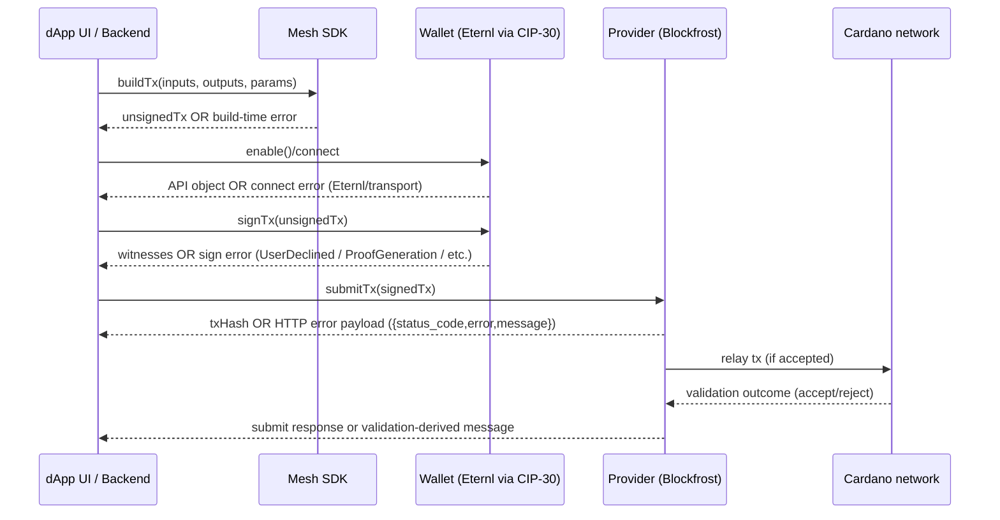

# Raw Error Payload Samples in the Cardano Ecosystem Across Mesh, Blockfrost, and Eternl

## Executive summary

This report compiles **nine** distinct, **verbatim raw error payload samples** (JSON or text) observed in primary sources across **Blockfrost** (official OpenAPI spec + developer hub + an SDK issue log), **Mesh** (one GitHub issue + one community Q&A log), and **Eternl** (official wiki error reference). citeturn11view0turn10view1turn9view0turn13view0turn2view0turn8view0  

Three patterns dominate:

1. **Provider-layer HTTP errors are highly structured** in Blockfrost: `{ status_code, error, message }`, with consistent semantics for auth (403), rate/usage limiting (429), and transaction submission backpressure (425). citeturn11view0turn10view1  
2. **Mesh often surfaces provider errors as “transaction submit error” strings** (sometimes with detailed ledger-era validation internals such as `ShelleyBasedEraBabbage` or `ShelleyBasedEraConway`), meaning the “error payload” developers see may be *two-layered*: a provider JSON wrapper and an inner node/ledger validation message string. citeturn13view0turn2view0  
3. **Eternl user-facing errors skew toward operational causes** (hardware-wallet transport/locking issues, backend connectivity, and transaction size constraints), and are often paired with concrete remediation steps (re-pair device, trigger a chain tip call, reduce token fragmentation). citeturn8view0  

A mermaid sequence diagram later in the report models where these errors typically occur along the **connect → query → build → sign → submit** pipeline.

## Scope and methodology

The scope is limited to **Cardano-related errors** involving:
- **Blockfrost** as a chain data and tx-submit provider (official OpenAPI + official developer hub + a real SDK error log from a GitHub issue). citeturn11view0turn10view1turn9view0  
- **Mesh** as an SDK surfacing tx-construction/submission failures (Mesh GitHub issue + Cardano Stack Exchange post). citeturn13view0turn2view0  
- **Eternl** as a wallet (official wiki “Errors and how to resolve them”). citeturn8view0  

Selection rules:
- Each sample is **a distinct raw payload** (JSON object, stack-trace object dump, or exact UI error string).  
- If **stage** (build/sign/submit/query/connect) or **network** is not explicit, it is marked **unspecified** per the request.  
- “Expected behavior/resolution” is included only when stated in the source or clearly documented; otherwise it is labeled **not stated** (or “inferred” when the source strongly implies it). citeturn10view1turn1view1turn8view0turn2view0  

External platforms referenced include entity["organization","GitHub","code hosting platform"] and entity["organization","Stack Exchange","q&a network"].

## Error sample catalogue

### Summary table

| ID | Service | Stage | Network / chain | Wallet / provider hint | Expected behavior / resolution (if known) | Exact source |
|---|---|---|---|---|---|---|
| BF-403 | Blockfrost | query (auth) | Cardano (network unspecified) | Provider auth via `project_id` token | Use the correct token for the target network; invalid/missing token yields 403; payload format is standardized. citeturn11view0turn10view1 | `https://raw.githubusercontent.com/blockfrost/openapi/daf40b1a88463bebd5d562bcabb18d5c001bf83e/openapi.yaml` citeturn11view0 |
| BF-429 | Blockfrost | query (rate/usage) | Cardano (network unspecified) | Provider rate/usage limiting | Indicates usage/rate limit exceeded; mitigation includes caching, plan upgrade, throttling (documented in Mesh provider troubleshooting and Blockfrost guidance). citeturn11view0turn1view1turn10view1 | `https://raw.githubusercontent.com/blockfrost/openapi/daf40b1a88463bebd5d562bcabb18d5c001bf83e/openapi.yaml` citeturn11view0 |
| BF-425 | Blockfrost | submit (tx submit) | Cardano (network unspecified) | Provider tx-submit endpoint backpressure | Documented meaning: mempool full; recommended behavior is retrying after waiting briefly. citeturn11view0turn10view1 | `https://raw.githubusercontent.com/blockfrost/openapi/daf40b1a88463bebd5d562bcabb18d5c001bf83e/openapi.yaml` citeturn11view0 |
| BF-ADDR-400 | Blockfrost (via blockfrost-js SDK) | query (address/UTxO lookup) | Cardano **preprod** endpoint used; address appears **mainnet-style** (`addr1...`) | blockfrost-js throws `BlockfrostServerError` with `status_code: 400`; likely network/address mismatch or malformed address for that network | Resolution not explicitly stated in the issue view; Blockfrost docs advise checking Bech32 and avoiding cross-network querying (e.g., testnet vs mainnet mixups). citeturn9view0turn10view1 | `https://github.com/Emurgo/cardano-serialization-lib/issues/606` citeturn9view0 |
| M-STAKE-400 | Mesh (using BlockfrostProvider) | submit | Cardano **preprod testnet** (explicit in issue) | MeshWallet (mnemonic/headless) + BlockfrostProvider; failure surfaced as rejected promise with `data.status_code: 400` and ledger validation details referencing `ShelleyBasedEraConway` | Expected fix not stated in the captured content; inner error indicates **missing key witnesses**, suggesting the tx was not fully signed for required keys (interpretation based on error text). citeturn13view0 | `https://github.com/MeshJS/mesh/issues/483` citeturn13view0 |
| M-PPVIEW | Mesh (using BlockfrostProvider; BrowserWallet) | submit (validation) | Cardano (likely preprod testnet; Blockfrost preprod key shown) | BrowserWallet enabled with Nami in code; thread mentions testing with Nami and Eternl; BlockfrostProvider used to fetch UTxOs | Resolution stated by responders: preprod protocol/cost-model changes caused a mismatch; updating Mesh (notably 1.5.1 mentioned) and/or waiting for provider sync resolved similar failures. citeturn2view0 | `https://cardano.stackexchange.com/questions/9855/transaction-submit-error-while-trying-to-unlock-funds-from-script-address-usin` citeturn2view0 |
| E-USB-REQUESTDEVICE | Eternl | connect (hardware wallet pairing) | unspecified | Eternl + hardware wallet over WebUSB (commonly entity["company","Ledger","hardware wallet maker"]-class devices) | Eternl wiki suggests deleting the wallet entry and re-pairing the hardware wallet. citeturn8view0 | `https://wiki.eternl.io/en/3_frequently-asked-questions/errors` citeturn8view0 |
| E-NO-CONNECTION | Eternl | connect / query (backend sync) | Cardano **mainnet** (explicit endpoint shown) | Eternl backend API connectivity | Eternl wiki: can occur at epoch boundary while servers catch up; suggests triggering the connection manually via the provided chain tip endpoint. citeturn8view0 | `https://wiki.eternl.io/en/3_frequently-asked-questions/errors` citeturn8view0 |
| E-VALUE-SIZE-5000 | Eternl | build (asset bundle size constraint) | unspecified | Eternl transaction building with many assets in a UTxO | Eternl wiki explains it as a protocol size limit and recommends “Token Fragmentation” and splitting large multi-asset UTxOs. citeturn8view0 | `https://wiki.eternl.io/en/3_frequently-asked-questions/errors` citeturn8view0 |

### Full raw payloads

**BF-403 — Blockfrost (403 Forbidden / Invalid project token)**

```json
{
  "status_code": 403,
  "error": "Forbidden",
  "message": "Invalid project token."
}
```

citeturn11view0  

**BF-429 — Blockfrost (429 Project Over Limit / Usage over limit)**

```json
{
  "status_code": 429,
  "error": "Project Over Limit",
  "message": "Usage is over limit."
}
```

citeturn11view0turn1view1  

**BF-425 — Blockfrost (425 Mempool Full)**

```json
{
  "status_code": 425,
  "error": "Mempool Full",
  "message": "Mempool is full, please try resubmitting again later."
}
```

citeturn11view0turn10view1  

**BF-ADDR-400 — blockfrost-js SDK thrown error object (Invalid address for this network or malformed address format)**

```text
BlockfrostServerError: Invalid address for this network or malformed address format.
    at handleError (.../node_modules/@blockfrost/blockfrost-js/lib/utils/errors.js:60:29)
    ...
{
  status_code: 400,
  error: 'Bad Request',
  url: 'https://cardano-preprod.blockfrost.io/api/v0/addresses/addr1q8fvgtajwpzvccdfxu5fjrmnh2rzyh46w7e5xn0yya5znvpcjn3zsax2qzsw24nppdmh78s7mknhulz8gu30tfy37flqnpr0rm/utxos?page=8&count=100&order=asc'
}
```

citeturn9view0turn10view1  

**M-STAKE-400 — Mesh issue showing rejected promise reason from Blockfrost submit with detailed ledger validation**

```text
{"data":{"error":"Bad Request","message":"{\"contents\":{\"contents\":{\"contents\":{\"era\":\"ShelleyBasedEraConway\",\"error\":[\"ConwayUtxowFailure (MissingVKeyWitnessesUTXOW (fromList [KeyHash {unKeyHash = \\\"af804f33d70e20d226bd8a40eb1b90a338f18c8df974ca56c6bc1754\\\"}]))\"],\"kind\":\"ShelleyTxValidationError\"},\"tag\":\"TxValidationErrorInCardanoMode\"},\"tag\":\"TxCmdTxSubmitValidationError\"},\"tag\":\"TxSubmitFail\"}","status_code":400},"headers":{"date":"Sun, 19 Jan 2025 03:31:56 GMT","content-type":"application/json; charset=utf-8","content-length":"444","connection":"keep-alive","vary":"Origin","access-control-allow-origin":"*","bf-submit-server":"e1f4ccc29ee5a9bb1f2d55e35e58119727c3f3f0e0da9c0cf0a9582299058083","cf-cache-status":"DYNAMIC","report-to":"{\"endpoints\":[{\"url\":\"https:\\/\\/a.nel.cloudflare.com\\/report\\/v4?s=c9WAYEzcne844gTmO1gowjZaN%2Bbboqsevra0W6iXAT4wH7h3hVY0HAt%2BIgqnGHfHEqeFhvji3Wa260Wa7I%2BbUTK3yOfySa2Bf7H4btKFt4I6ZllKj1sxWYQPUQU77k4zLE13Kadv5F%2FjNtDOCsad\"}],\"group\":\"cf-nel\",\"max_age\":604800}","nel":"{\"success_fraction\":0,\"report_to\":\"cf-nel\",\"max_age\":604800}","set-cookie":"__cflb=0pg1P7HW5cKHeRugHdPsq7nS66pKUqQnoGCQ27gh; SameSite=Lax; path=/; expires=Sun, 19-Jan-25 04:01:56 GMT; HttpOnly","server":"cloudflare","cf-ray":"9043c1341d3b7b4c-BKK","server-timing":"cfL4;desc=\"?proto=TCP&rtt=10071&min_rtt=4190&rtt_var=11584&sent=10&recv=9&lost=0&retrans=0&sent_bytes=5370&recv_bytes=1980&delivery_rate=817438&cwnd=255&unsent_bytes=0&cid=9d670bc723770a4f&ts=1317&x=0\""},"status":400}
```

citeturn13view0  

**M-PPVIEW — Mesh “transaction submit error … PPViewHashesDontMatch …”**

```text
transaction submit error ShelleyTxValidationError ShelleyBasedEraBabbage
(ApplyTxError [UtxowFailure (FromAlonzoUtxowFail
(PPViewHashesDontMatch (SJust (SafeHash
"6ea33d2943315bf6179393f97af792376fd0c29851831b183c96a395db712337"))
(SJust (SafeHash
"ed2dc348e2070315e474c83981b40015d1dec8eaee9704735776e4d6147f7c41"))))])
```

citeturn2view0  

**E-USB-REQUESTDEVICE — Eternl hardware wallet selection error (WebUSB)**

```text
Failed to execute 'requestDevice' on 'USB': No device selected.
```

citeturn8view0  

**E-NO-CONNECTION — Eternl backend connection status error**

```text
Status: No connection
```

Associated endpoint referenced by the Eternl wiki entry:

```text
https://api.eternl.io/mainnet/v1/chain/tip
```

citeturn8view0  

**E-VALUE-SIZE-5000 — Eternl asset bundle size limit error**

```text
Maximum value size of 5000 exceeded
```

citeturn8view0  

## Error-flow model

The following sequence diagram abstracts the most common error propagation path when a dApp uses Mesh as a client SDK, a wallet like Eternl for signing, and Blockfrost for querying/submitting:



The key practical implication is that a “submit error” seen by the dApp can originate from:
- wallet refusal / inability to sign (prior to submission),
- provider backpressure (e.g., 425 mempool full),
- ledger validation failure (e.g., missing witnesses, protocol parameter mismatches),
- or simple address/network mismatches during queries. citeturn11view0turn10view1turn13view0turn2view0turn9view0  

## Cross-cutting analysis

Blockfrost’s official OpenAPI specification shows that many operational failures are normalized into a compact **three-field JSON error contract** (`status_code`, `error`, `message`). citeturn11view0 This is advantageous for client libraries (including Mesh’s BlockfrostProvider integration) because it enables straightforward programmatic branching on `status_code` for retry/backoff/auth refresh flows. citeturn1view1turn11view0  

However, developer-visible errors can still become difficult to interpret when a provider embeds *chain-level validation data* as a serialized string inside the `message` field. In the Mesh staking submission failure sample, Blockfrost returns `{ error: "Bad Request", status_code: 400 }` while the `message` string contains a deeply nested tx validation structure ending with `MissingVKeyWitnessesUTXOW`, which is a **semantic signing/witness completeness problem** rather than a transport failure. citeturn13view0  

On the wallet side, Eternl’s official error documentation emphasizes that a sizable subset of failures are **environmental** rather than protocol-level: device selection, device/bus locking (“another program or tab is currently using the connection”), and backend “catching up” conditions that can present as “Status: No connection.” citeturn8view0 This matters because dApp developers often misattribute these to on-chain faults (e.g., “tx failed”), when the correct remediation is actually *local operational recovery* (re-pair, close competing apps, trigger a backend query). citeturn8view0  

Finally, community reports around Mesh highlight an important operational risk for testnets: **protocol parameter / cost model changes** can produce submit-time validation errors such as `PPViewHashesDontMatch`, which may be resolved by updating SDKs (to pick up new parameters) and/or waiting for providers to synchronize. citeturn2view0  

## References and caveats

Blockfrost’s developer hub explicitly lists supported Cardano networks and notes that **each network has its own token**, and using a token for the wrong network can cause authorization errors. citeturn10view1 The OpenAPI spec itself enumerates base URLs for Cardano mainnet, preprod, and preview. citeturn11view0  

Mesh’s Blockfrost provider page provides pragmatic remediation guidance for common provider errors such as 403 (“Project not found” / network mismatch) and 429 (rate limiting). citeturn1view1  

Eternl’s official error page provides explicit, step-by-step remediation for several high-frequency user errors, including WebUSB device selection, backend connection state, and multi-asset value size constraints. citeturn8view0